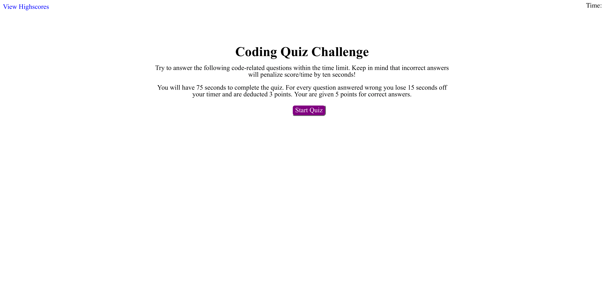

# Code_Quiz

## Project Description

As a coding boot camp student I want to take a timed quiz on JavaScript fundamentals that stores high scores so that I can gauge my progress compared to my peers.

## User Story Criteria

GIVEN I am taking a code quiz
WHEN I click the start button
THEN a timer starts and I am presented with a question
WHEN I answer a question
THEN I am presented with another question
WHEN I answer a question incorrectly
THEN time is subtracted from the clock
WHEN all questions are answered or the timer reaches 0
THEN the game is over
WHEN the game is over
THEN I can save my initials and my score

## Deployed Site

Here is an image of the website:

Link to deployed site: https://altankg.github.io/Code_Quiz/
